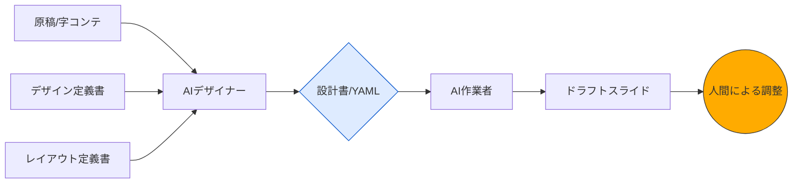

<!-- Slide 1: 表紙 -->
<!-- layoutId: S01 -->
<section class="title-cover">

# AIスライド生成の「構造化」アプローチ
## エンジニアリング視点で実現する、意図通りの高品質スライド作成術

AI活用による業務効率化ガイド

</section>

---

<!-- Slide 2: アジェンダ -->
<!-- layoutId: S02 -->
<section>

# 本日のアジェンダ

- 1. AIスライド生成の現状と課題
- 2. 解決策：情報を構造化して与える
- 3. スライド作成プロセスの3フェーズ分解
- 4. Phase 3：視覚化における具体的ステップ
- 5. まとめ：人間とAIの最適な役割分担

</section>

---

<!-- Slide 3: AIスライド生成の現状と限界 -->
<!-- layoutId: C01 -->
<section>

# AIスライド生成の現状と限界

### 現状（できること）
- **多様なツールの登場:** Gemini, Nano Banana Pro, NotebookLM等
- **手軽な生成:** 雑な指示や文章から「それっぽい」スライドが即座に完成

### 限界（課題）
- **既視感とAI臭さ:** どこかで見たようなデザインになりがち
- **制御不能なランダム性:** 再現性がなく、意図が反映されにくい
- **実用性の不足:** 公式な発表には耐えられない品質

</section>

---

<!-- Slide 4: 解決策：情報を構造化して与える -->
<!-- layoutId: L02 -->
<section>

# 解決策：情報を構造化して与える

### 構造化アプローチとは
AIに対して自然言語だけで依頼するのではなく、MarkdownやMermaid、YAMLなどの**「構造化された形式」**を介して対話する手法。

### 期待される効果
<ul class="check-list">
<li><strong>認識の一致:</strong> AIとの解釈のズレを最小限に抑えられる</li>
<li><strong>修正の容易さ:</strong> 構造化データの一部を書き換えるだけで正確な修正が可能</li>
<li><strong>再現性の確保:</strong> 意図したレイアウトや論理構成を確実に維持できる</li>
</ul>

</section>

---

<!-- Slide 5: スライド作成プロセスの3フェーズ分解 -->
<!-- layoutId: P01 -->
<section>

# スライド作成プロセスの3フェーズ分解

Phase 1: 着想
断片的な情報から核（コア）を抽出。誰に何を伝えたいかを明確にする。

Phase 2: 言語化
核となる想いからストーリーを構成。文字だけの原稿（字コンテ）を作成。

Phase 3: 視覚化
デザイン整頓、レイアウト配置。完成版のスライドへ昇華させる。

↑ 今回のメインテーマ

</section>

---

<!-- Slide 6: Phase 1 & 2 におけるAIの役割 -->
<!-- layoutId: L02 -->
<section>

# Phase 1 & 2：着想と言語化でのAI活用

### Phase 1: 着想
**AIは「壁打ち相手」** 🎾
- 対話を通じて自分の考えの解像度を上げる
- ターゲットとメッセージの整合性を確認する

### Phase 2: 言語化
**AIは「編集者」** ✍️
- テキストのみで論理構造を組み立てる
- 軸を補強するように原稿をブラッシュアップさせる

</section>

---

<!-- Slide 7: Phase 3：視覚化のプロセスを分解する -->
<!-- layoutId: P01 -->
<section>

# Phase 3：視覚化のプロセスを分解する

Step 0 <strong>テンプレート言語化</strong>

→

Step 1 <strong>デザインを言語化</strong>

→

Step 2 <strong>ドラフト生成</strong>

→

Step 3 <strong>最終調整</strong>

※エンジニアリング的なパイプラインとしてスライド作成を捉える

</section>

---

<!-- Slide 8: Step 0: デザインテンプレートの言語化 -->
<!-- layoutId: L03 -->
<section>

# Step 0: デザインテンプレートの言語化

### グローバルデザイン
カラーパレット、フォント、トーン＆マナー（信頼感、先進性など）を規定。

### レイアウト定義
S01（表紙）、L01（箇条書き）など、使用可能な型をID化して管理。

### 構造の制約
ヘッダー・ボディ・フッターの比率や、情報の密度をあらかじめ指定。

colors: { primary: "#0052CC", accent: "#00B8D9" } 
layouts: [ { id: "S01", name: "Title Slide" }, ... ]

</section>

---

<!-- Slide 9: 構造化による「コンパイル」のイメージ -->
<!-- layoutId: T03 -->
<section>

# 構造化による「コンパイル」のイメージ

中間形式としての<strong>「設計書」</strong>を介することで、制御性と再現性が生まれる。

</section>

---

<!-- Slide 10: まとめ：効率的に実用的なスライドを作るために -->
<!-- layoutId: L01 -->
<section>

# まとめ：効率的に実用的なスライドを作るために

- **「いい感じに」を禁止する:** 曖昧な指示を排除し、構造化データで意思を伝える。
- **フェーズを分離する:** 思考（Phase 1, 2）と作業（Phase 3）を混ぜない。
- **AIの役割を使い分ける:** 壁打ち相手、編集者、デザイナー、作業者として適切にアサイン。
- **人間は「レビュー」に注力する:** ゼロから作らず、AIが生成した構造を修正するスタイルへ。

</section>

---

<!-- Slide 11: エンディング -->
<!-- layoutId: S04 -->
<section class="center-message">

## ご清聴ありがとうございました

AIと共に、より創造的なプレゼン作成を。

構造化アプローチで、スライド作成は「作業」から「設計」へ変わります。

</section>